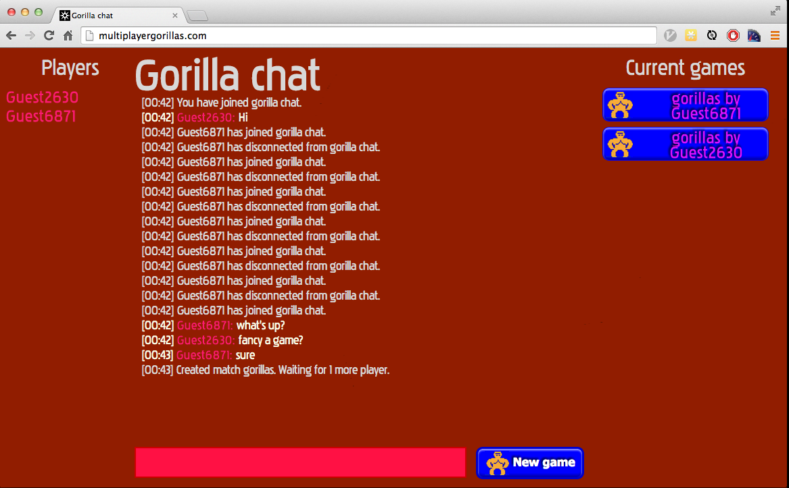
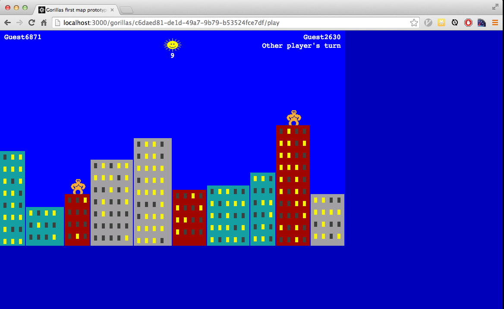

node-games-lobby
=================
A matchmaking server and chat system for multiplayer online games.

The games must have a NodeJS back-end that implements a small number of methods
required by the server.

A live demo is running at [http://multiplayergorillas.com](http://multiplayergorillas.com).

Features
----
* Chat across games with private messages, announcements, lobbies, public rooms.
* Games must conform only to a simple documented API.
* Example games (tictactoe and gorillas) provided.

Why would this be useful to you?
----
* You have some games you would like people to play.
* You want to write games but you don't want to deal with the lobby, matchmaking and chat elements.
* You are happy for those games to conform to a simple API for the sake of the
  aforementioned conveniences.

Requirements
----
* bower for installing client dependencies.
* mocha for running the tests.
* redis for storing user sessions, `redis-server` on Ubuntu.

Getting Started
----
* Clone this repository.
* Install bower globally, `npm install -g bower`.
* Install required modules, `npm install`.
* Run the tests, `npm test` (requires [mocha](http://visionmedia.github.io/mocha/) `npm install -g mocha`).
* Start the server `npm start` and access it from a web browser.
* Look at the code for the example tictactoe and gorillas games.

Future improvements
----
* Improved login and account management.
* Games with more than 2 players.
* Webservice API for games and account handling.

Screenshots
----

License
----
MIT.
